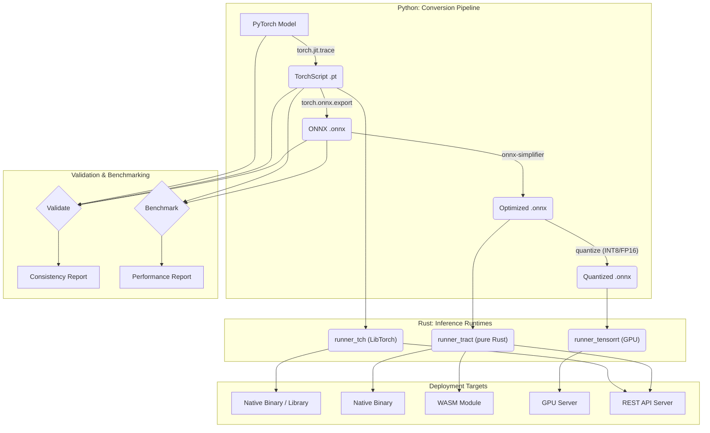
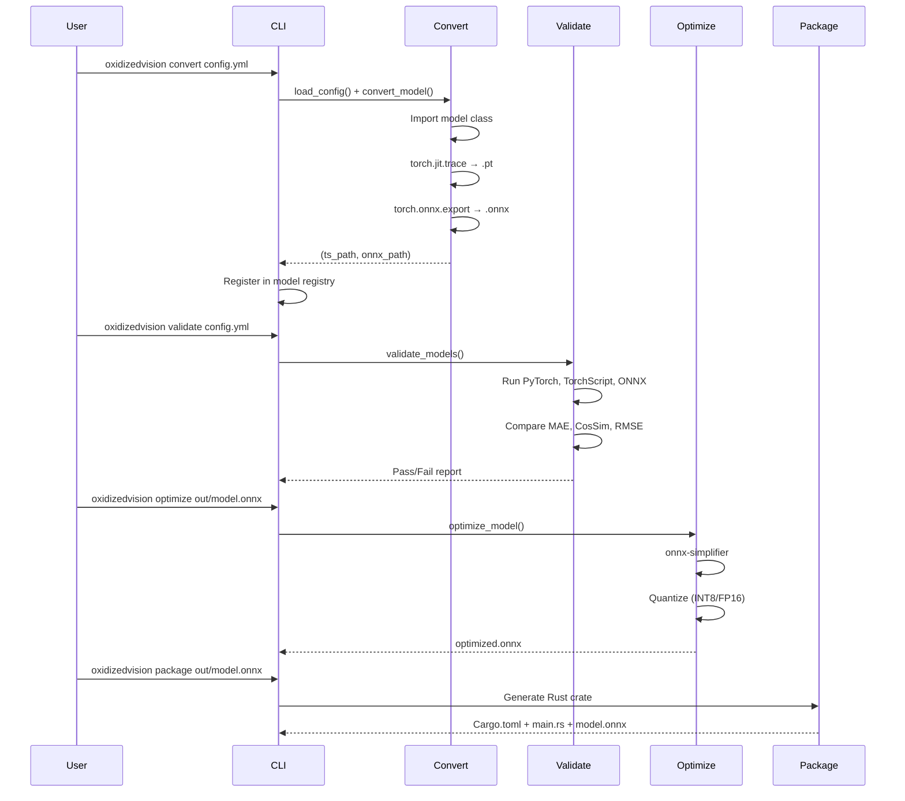

# OxidizedVision Architecture

This document provides a detailed overview of the OxidizedVision architecture, components, and workflows.

## 1. High-Level Overview

OxidizedVision is designed as a pipeline that transforms PyTorch models into efficient Rust artifacts. The core philosophy is to provide a seamless and automated workflow for developers, from a trained model in Python to a deployed inference service in Rust.

The main stages of the pipeline are:

1.  **Conversion**: A PyTorch model is converted to TorchScript and then to the ONNX format.
2.  **Optimization**: The ONNX model is optimized (simplified, quantized) for inference.
3.  **Validation**: Outputs are compared across formats to ensure numerical consistency.
4.  **Benchmarking**: Performance is measured across different backends.
5.  **Packaging**: The optimized model is packaged into a Rust crate with a chosen runtime.
6.  **Deployment**: The Rust crate can be built into a binary, a library, or a WebAssembly module.



## 2. Core Components

### 2.1. Python Client (`python_client/`)

The Python client is the main entry point for users. It provides:

-   **CLI (`cli.py`)**: Built with `Typer`, offers commands: `convert`, `validate`, `benchmark`, `optimize`, `profile`, `package`, `serve`, `list`, `info`.
-   **Configuration (`config.py`)**: Strongly-typed Pydantic models for YAML configuration, with validation and defaults.
-   **Conversion (`convert.py`)**: PyTorch → TorchScript + ONNX with dynamic axes support.
-   **Validation (`validate.py`)**: Multi-format comparison with MAE, RMSE, Max Error, and Cosine Similarity metrics.
-   **Benchmarking (`benchmark.py`)**: Latency (avg, p50, p95, p99), throughput, and memory measurement across runners.
-   **Optimization (`optimize.py`)**: ONNX graph simplification, constant folding, INT8/FP16 quantization.
-   **Profiling (`profile.py`)**: Parameter count, model size estimation, per-layer breakdown.
-   **Registry (`registry.py`)**: Local JSON-based model tracking and metadata management.

### 2.2. Rust Runtimes (`rust_runtime/`)

The Rust part of the project is a workspace containing several crates. The key design pattern is a shared **`Runner` trait** defined in `runner_core` that all backends implement.

#### Runner Trait (`runner_core`)

```rust
pub trait Runner: Send + Sync {
    fn from_config(config: &RunnerConfig) -> Result<Self> where Self: Sized;
    fn run(&self, input: &ArrayD<f32>) -> Result<ArrayD<f32>>;
    fn info(&self) -> ModelInfo;
}
```

Key design decisions:
- **Dynamic-dimensional arrays** (`ArrayD<f32>`) instead of fixed 4D to support arbitrary model architectures.
- **`RunnerConfig`** struct encapsulates all loading parameters (path, input shape, CUDA flag, etc.).
- **`Send + Sync`** bounds enable safe concurrent use in async servers.

#### `runner_tch`

-   **Backend**: `tch-rs` crate (LibTorch C++ bindings)
-   **Model Format**: TorchScript (`.pt`)
-   **Supports**: CPU and CUDA inference
-   **Pros**: 100% parity with PyTorch
-   **Cons**: Requires LibTorch installation

#### `runner_tract`

-   **Backend**: `tract` crate (pure-Rust ONNX engine)
-   **Model Format**: ONNX (`.onnx`)
-   **Supports**: CPU inference, WebAssembly targets
-   **Special**: `load_from_bytes()` for WASM in-browser loading
-   **Pros**: Lightweight, no external dependencies, portable
-   **Cons**: May not support all ONNX operators

#### `runner_tensorrt`

-   **Backend**: NVIDIA TensorRT via `trtexec` subprocess
-   **Model Format**: ONNX → TensorRT Engine (`.engine`)
-   **Supports**: NVIDIA GPU inference with FP16/INT8
-   **Pros**: Maximum GPU performance
-   **Cons**: Requires TensorRT SDK installation

### 2.3. Example Applications (`rust_runtime/examples/`)

-   **`image_server`**: `actix-web` REST API with `/predict` and `/health` endpoints, JSON I/O, configurable input shapes.
-   **`denoiser_cli`**: CLI tool with proper image preprocessing (resize, normalize, HWC↔CHW), inference, and postprocessing (denormalize, save).
-   **`wasm_frontend`**: Browser-based inference with model upload, configurable input shapes, and styled results display.

## 3. The Conversion Pipeline in Detail



## 4. Configuration Schema

```yaml
model:
  path: examples/example_unet/model.py    # Path to model definition
  class_name: UNet                         # nn.Module class name
  input_shape: [1, 3, 256, 256]           # Input tensor shape
  checkpoint: null                         # Optional: checkpoint file

export:
  opset_version: 14                        # ONNX opset version
  do_constant_folding: true
  output_dir: out                          # Output directory
  model_name: model                        # Base filename

runners:
  - name: tract
    optimize: true
  - name: tch
    use_cuda: true

validation:
  num_tests: 1                             # Number of random inputs
  tolerance_mae: 1e-5
  tolerance_cos_sim: 0.999

optimize:
  simplify: true
  quantize: null                           # 'int8', 'fp16', or null
  constant_folding: true

benchmark:
  iters: 100
  batch_size: 1
  warmup_iters: 10
  device: cpu                              # 'cpu' or 'cuda'
```

## 5. Troubleshooting

### Common Issues

| Problem | Solution |
|---------|----------|
| `ModuleNotFoundError` | Ensure `pip install -e "./python_client"` was run |
| `torch.jit.trace` fails | Model may have data-dependent control flow; try `torch.jit.script` |
| ONNX export errors | Try a lower `opset_version` (e.g., 11) |
| LibTorch not found | Set `LIBTORCH` env var or install via `pip install torch` |
| TensorRT unavailable | Install TensorRT SDK and add `trtexec` to PATH |
| WASM build fails | Install `wasm-pack`: `cargo install wasm-pack` |
